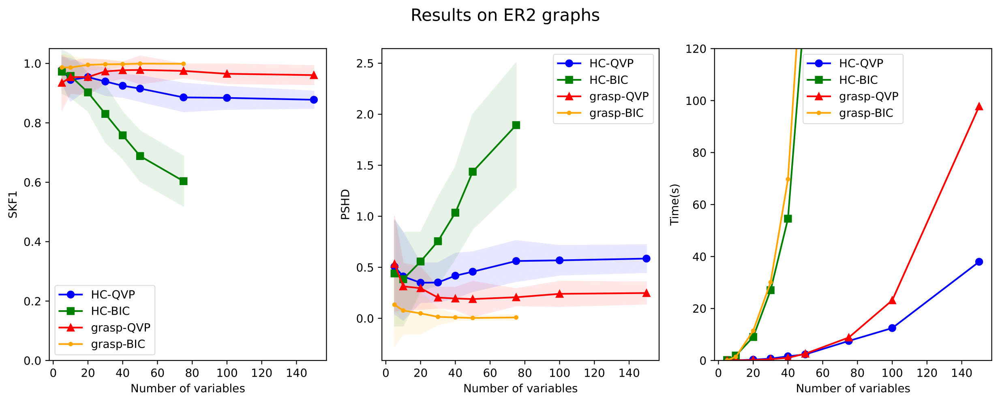
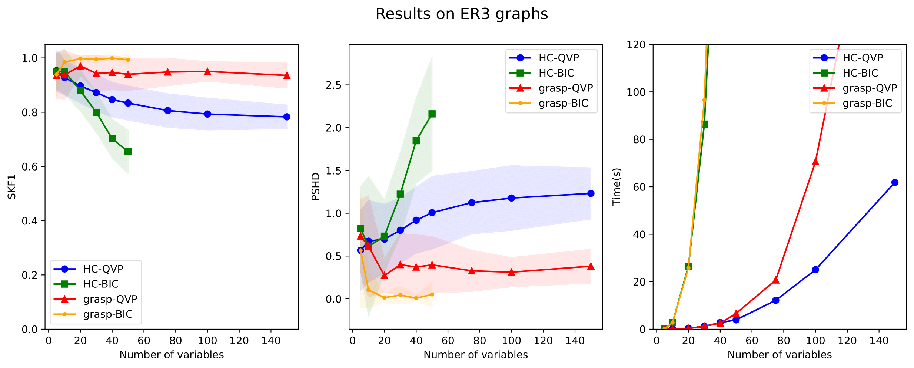
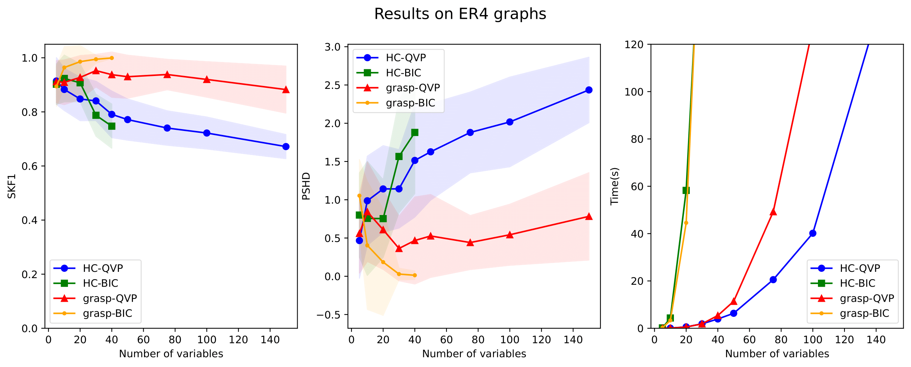

# QVP: Speeding Up Permutation-Based Causal Discovery in LiGAMs

In this project, you can find the official codes of the paper titled "QVP: Speeding Up Permutation-Based Causal Discovery in LiGAMs" and instructions on how to run them. The codes are in python. 

## Requirements

To install requirements you need to run the following command:

```setup
pip install -r requirements.txt
```


## Run an experiment

To run a new experiment you only need to change the *config.py* file and then run the following command:

```setup
python3 main.py
```

To modify the data generation process, you can specify the number of variables, the number of data points, the average degree of each node in the Erdos-Renyi graph, and the type of noise in the model (options include Gaussian, exponential, and Gumbel) in the *config.py* file. Additionally, to run an experiment on your existing data, simply insert the path to your pickle file containing the data matrix in CONFIG.path_to_data.

The search method and its parameters can be specified using CONFIG.search_method and CONFIG.search_params.

## Results  

The following figure from the paper compares the accuracy and execution time between our method and the state-of-the-art BIC-based score, evaluated on both search methods and varying numbers of variables. $ERn$ denotes the random graph constructed by the Erdős–Rényi method with an average node degree of $n$. For the definition of metrics, refer to the experiments section of the paper. As illustrated in the figure, across all settings, QVP’s accuracy is higher with the Hill Climbing search method and relatively good with GRaSP, while demonstrating a significant speed improvement over BIC in both search methods.




